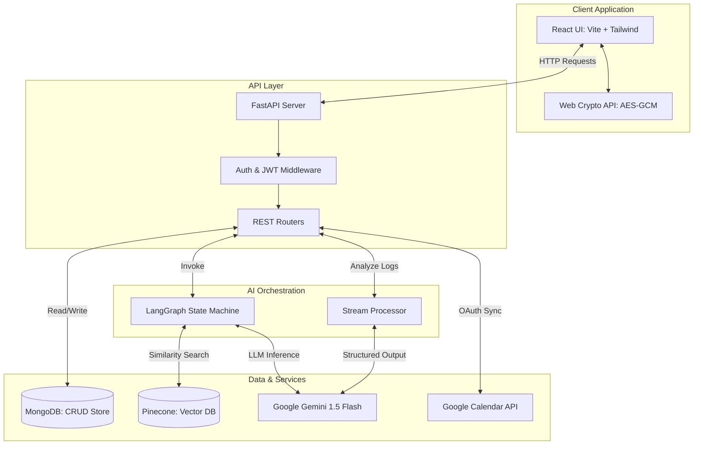
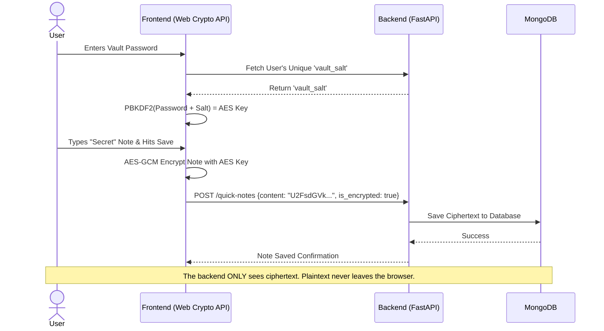
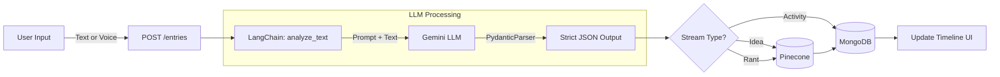
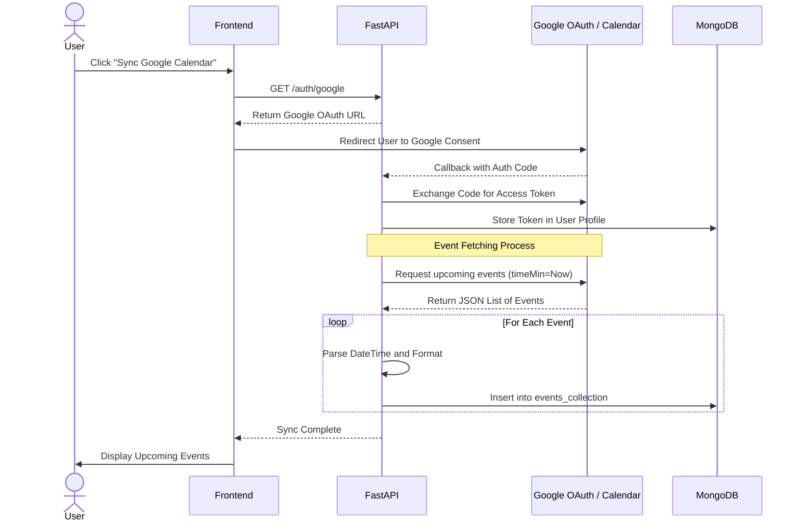
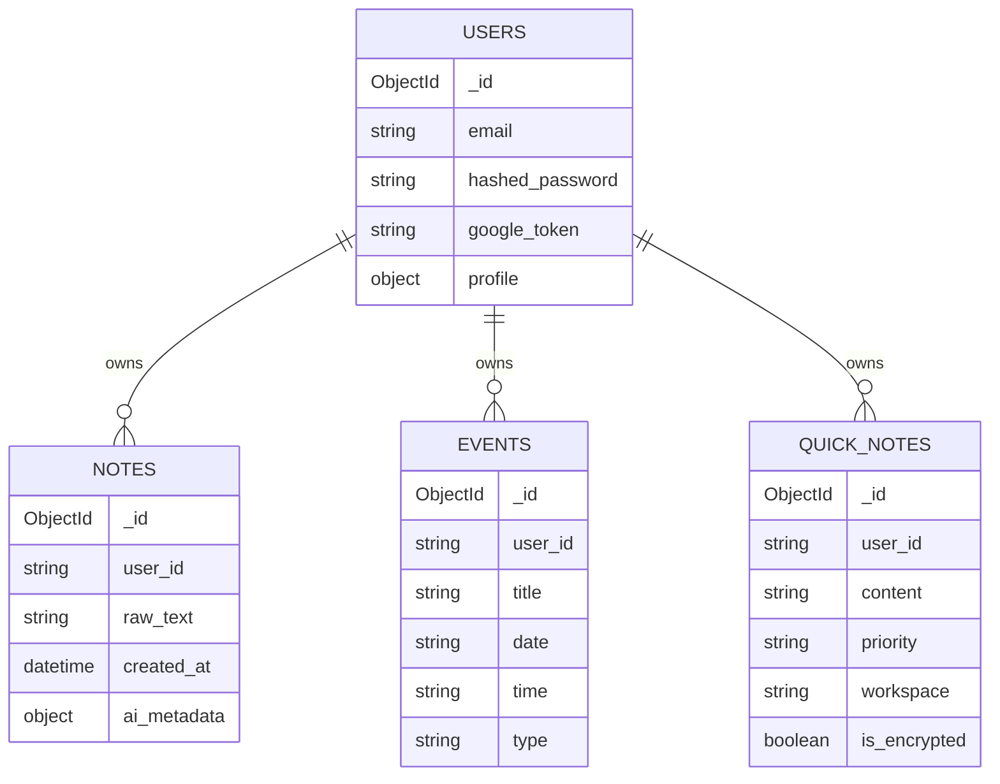

# 🏛️ Shadow OS - Architecture & User Flows

This document outlines the system architecture and specific user flows for the core modules of Shadow OS. It is designed to help developers, contributors, and reviewers understand how data moves through the application.

---

## 1. High-Level System Architecture

This diagram shows the bird's-eye view of how all the components interact.

---

## 2. Module Flows

### Module A: The Bicameral UI & RAG Pipeline (The Memory Wall)
This flow demonstrates how the UI theme dictates the AI's personality and what memories it is allowed to access.

```mermaid
sequenceDiagram
    actor User
    participant UI as Frontend (React)
    participant API as Backend (FastAPI)
    participant Pinecone as Pinecone (Vector DB)
    participant Gemini as Gemini 1.5 Flash

    User->>UI: Selects "Shadow" or "Zenith" Mode
    UI->>UI: Updates CSS Variables (Colors/Fonts)
    User->>UI: Sends Chat Message
    UI->>API: POST /chat {message, history, mode}
    API->>Pinecone: Query Vector DB for Semantic Context
    Pinecone-->>API: Return Top-K Historical Logs
    
    rect rgb(30, 41, 59)
    Note over API: THE MEMORY WALL FILTER
    alt Mode == "Shadow"
        API->>API: Filter out "Rant" & "Personal" logs
    else Mode == "Zenith"
        API->>API: Allow all logs (Holistic Context)
    end
    end

    API->>Gemini: Inject Context + System Prompt (Shadow or Zenith)
    Gemini-->>API: Generate Persona-Specific Response
    API-->>UI: Return Response
    UI-->>User: Display Message
```

### Module B: Zero-Knowledge Encrypted Vault
This flow shows how highly sensitive user notes are encrypted before leaving the browser, ensuring the server cannot read them.

### Module C: Stream Processor (Timeline Classification)
When a user adds a log to their timeline (via text or voice), the AI automatically categorizes and scores it.

### Module D: Google Calendar Synchronization
This module allows Shadow OS to pull in real-world calendar events and display them alongside internal tasks.

---

## 3. Database Schema Overview

A simplified view of the primary MongoDB collections.

